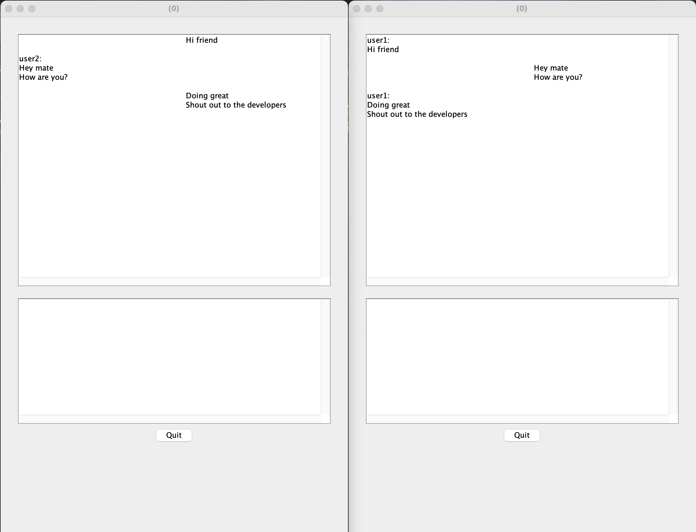

# TCP Chat 
## Description

A socket-based chatting P2P desktop application. 
Allows for creating users, chats, and sending messages within those chats.
All of the messages are saved on the server, so every time a user logs in, their messages and chats get downloaded from the server.
Allows for multiple connections with the same username.

Both the server and the client applications are completely asynchronous and thread-safe. 
The client side is based on the publish-subscribe pattern, guaranteeing proper callback flow.
Uses a JSON-driven API.

## User guide
The server is dockerized and can be run with docker compose. To start the server from the root, run 
``` console
cd server/deployment
docker compose up
```

The client is compiled into a jar stored in the `app` folder. To start the client from the root, run
``` console
java -jar app/app.jar
```

Opening the client will greet you with a signup/login window where you can create an account or sign up as an existing user.
After creating an account, you can create a new chat by pressing `Create Chat` and `Enter/Return`. 
Others can join by pressing `Create Chat` and entering the chat ID which can be seen on top of the opened chat. 

The application also supports shortcuts. For example, you can use numbers to swap between open chats.

## Showcase 

